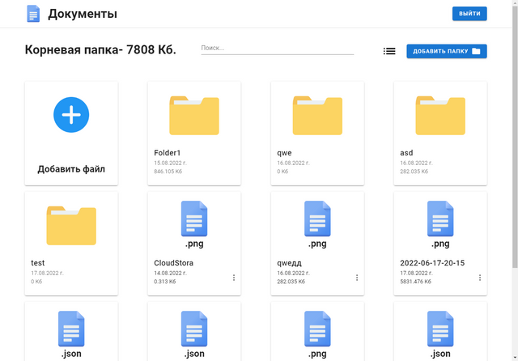
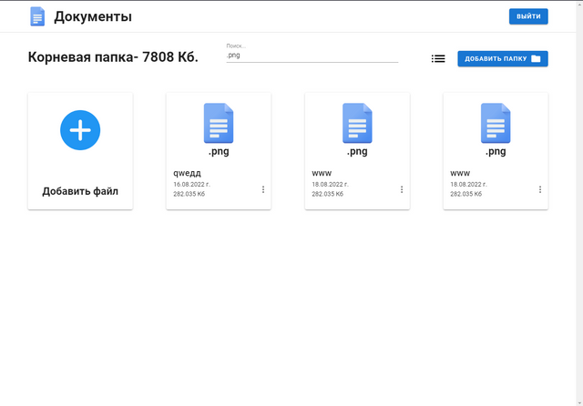
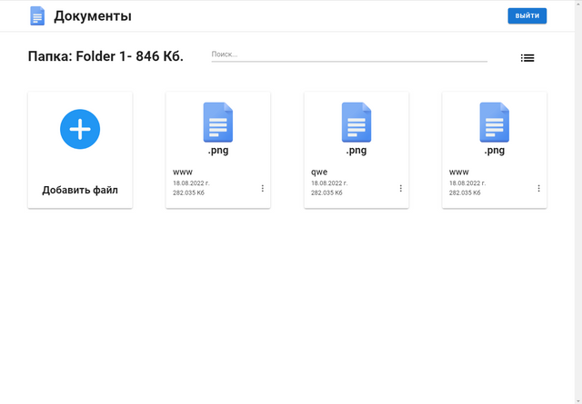

# Docsmanager

К сожалению проект сейчас не работает, т.к он делался в рамках тестового задания для собеседования, запросы для работы приложения посылаются на сервер компании для которой я делал это приложение и сервер сейчас не работает. В будущем я постараюсь это исправить, но сейчас функционал приложения можно посмотреть из гифки ниже.

Docksmanager it cloud storage service for files.After registration or authorization, you will be able to upload files, rename, delete and receive a direct download link, you can also create folders.There is a search to filter the contents of the vault, for example by file type.

## Run App

Use the package manager [npm](https://pip.pypa.io/en/stable/) to install app modules:

```bash
npm install
```
Launch the application using the following command:
```bash
npm run serve
```
### App:


### Main page:


### Filtred by file type:


### Folder page:


## License
[MIT](https://choosealicense.com/licenses/mit/)
